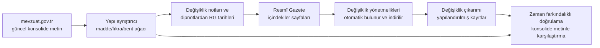

# MevzuatRadar

Türk bankacılık mevzuatındaki değişiklikleri Resmî Gazete'den otomatik olarak bulan, hangi düzenlemenin hangi maddesinin nasıl değiştiğini yapılandırılmış kayıtlara dönüştüren ve bu kayıtları **elle etiket kullanmadan** doğrulayan bir document intelligence sistemi.

## Problem

BDDK, MASAK ve TCMB düzenlemeleri sık değişir ve değişiklik metinleri tek başına okunduğunda anlamsızdır:

> Aynı Yönetmeliğin 26/Ç maddesinin başlığı “Bilgi alışverişi kuruluşlarında iç denetim sistemi” şeklinde, birinci, dördüncü ve beşinci fıkralarında yer alan “Bilgi alışverişi, takas ve mahsuplaşma kuruluşları” ibareleri “Bilgi alışverişi kuruluşları” şeklinde değiştirilmiştir.

Bu tek cümle dört ayrı değişiklik içerir: bir başlık değişikliği ve üç farklı fıkrada ibare değişikliği. Bankaların uyum ekipleri bu tür değişiklikleri elle takip edip ilgili maddeye işler. MevzuatRadar bu süreci otomatikleştirir.

## Nasıl çalışır



1. **Toplama:** Bir düzenlemenin güncel (konsolide) metni indirilir.
2. **Keşif:** Konsolide metindeki "(Değişik:RG-25/9/2020-31255)" notları ve dipnotlar okunur; bunlardan değişiklik tarihleri çıkarılır ve Resmî Gazete'nin günlük içindekiler sayfalarından ilgili değişiklik yönetmeliklerinin bağlantıları **otomatik olarak** bulunur.
3. **Çıkarım:** Her değişiklik yönetmeliğinden, hangi maddenin hangi fıkrasına ne yapıldığını anlatan kayıtlar çıkarılır (ibare değiştirme/ekleme/kaldırma, fıkra/bent/madde değiştirme/ekleme/kaldırma, başlık değişikliği).
4. **Doğrulama:** Her kaydın etkisi konsolide metinde aranır. Aynı birime sonradan başka bir değişiklik dokunmuşsa kayıt hata sayılmaz, "sonradan değişti" olarak ayrılır.

### Temel fikir: etiket yerine konsolide metin

Değişiklik çıkarımı için hazır etiketli bir Türkçe veri seti yok. Ancak her düzenlemenin güncel hali zaten yayımlanıyor. Bir değişiklik doğru çıkarıldıysa, etkisi güncel metinde görünmelidir. Bu, elle etiketleme yapmadan çıkarım kalitesini ölçmeyi sağlar.

## Sonuçlar

13 yönetmelik, üç düzenleyici kurum (BDDK, MASAK, TCMB) ve 2008'den 2026'ya uzanan **84 değişiklik yönetmeliği** üzerinde değerlendirilmiştir.

Doğrulama oranı = uyumlu / (uyumlu + uyumsuz + hedef bulunamadı). "Sonradan değişti" ve elle doğrulanmış "kaynak tutarsızlığı" kayıtları hesaba katılmaz.

### 1. Kural sisteminin genelleme ölçümleri

Kural sistemi hiç görmediği yönetmeliklerde **kodda değişiklik yapılmadan** üç kez ölçüldü; ilk sonuçlar dondurularak saklandı (`reports/heldout_*_v1.jsonl`):

| Ölçüm | Yönetmelikler | Doğrulanan / kontrol edilebilir | Oran |
|---|---|---|---|
| 1 | MASAK Uyum Programı, BDDK Kredi Sınıflandırma, TCMB Ödeme Hizmetleri | 94 / 106 | %88,7 |
| 2 | 6 BDDK yönetmeliği (sermaye yeterliliği, likidite, muhasebe, iç sistemler, destek hizmeti, uzaktan kimlik) | 95 / 120 | %79,2 |
| 3 — **test seti** | Finansal Kiralama Kuruluş ve Faaliyet, FK Muhasebe Uygulamaları | 39 / 40 | %97,5 |

İkinci ölçümdeki düşüş, formül ve tablo içeren teknik yönetmeliklerin kurallar için ne kadar zor olduğunu gösteriyor. Üçüncü ölçümdeki yükseliş ise aradaki hata analizlerinde yapılan düzeltmelerin (dipnotlar, çok harfli bentler, eşanlamlı kalıplar, ekler) genelleştiğini gösteriyor. Test yönetmeliklerinin hatalarına karşılaştırma bitene kadar hiç bakılmadı.

### 2. Kural sistemi ile makine öğrenmesi modelinin karşılaştırması

Kural sistemi + doğrulama ile üretilen **gümüş etiketlerle** (256 eğitim örneği) bir **mT5-small** modeli eğitildi. Model, alıntı metinlerini kopyalamak yerine işlemi ve konumu üretir; uzun alıntılar sonradan yerlerine konur. Üç sistem, hiçbirinin görmediği test setinde **aynı doğrulama hattıyla** ölçüldü:

| Sistem | Doğrulanan değişiklik | Hatalı kayıt | Doğrulama oranı |
|---|---|---|---|
| Kural sistemi | 39 | 1 | %97,5 |
| mT5-small | 33 | 8 | %80,5 |
| **Hibrit**: kural sistemi; kuralın hiçbir kayıt çıkarmadığı maddelerde model | **41** | 3 | %93,2 |

- **Tek başına model kural sisteminden zayıf**, ama kuralların kör noktalarında işe yarıyor: kural sisteminin hiçbir şey çıkaramadığı iki maddede (iki geçici madde eklemesi) doğrulanmış değişiklik buldu ve kural sisteminin test setindeki tek hatalı maddesini doğru çözdü.
- **Hibrit, doğrulanan değişiklik sayısını %5 artırdı** ve bunun karşılığında iki yanlış kayıt ekledi. Hibrit kuralı sonuçlara bakılarak değil, önceden tanımlandı ve doğrulama sinyali kullanmıyor (yeni yayımlanan bir değişiklikte konsolide metin henüz güncellenmemiş olur).
- **Pratik öneri:** Kural sisteminin kayıtları otomatik kabul edilir, modelin eklediği kayıtlar "insan onayı gerekiyor" olarak işaretlenir. Uyum takibinde bir değişikliği kaçırmanın maliyeti, yanlış bir uyarıyı incelemekten çok yüksektir.

Modelin başlıca hata türleri: karmaşık, çok hedefli maddelerde yapının çökmesi ve kayıt düzeyinde tekrar döngüleri. Küçük veriyle eğitilen üretici modellerin tipik zaafları.

### 3. Ölçümle ilgili iki ders

- **Kopyalama kısıtı:** Model ilk denemede ibareleri eğitim verisinden ezberlediği metinlerle "uyduruyordu". Değişiklik cümlelerinde ibareler her zaman tırnak içinde verildiği için, modelin ürettiği ibare girdideki en yakın tırnaklı ifadeye eşlendi; geliştirme setinde doğrulama oranı %55'ten %67'ye çıktı.
- **Tekrarların sayılması:** Değerlendirme aracı başlangıçta modelin tekrarladığı her kaydı ayrı saydı. Bu, aynı modeli geliştirme setinde olduğundan iyi (doğru kayıtların kopyaları), test setinde olduğundan kötü (yanlış kayıtların kopyaları, %33) gösterdi. Tekrarlar tekilleştirildiğinde test sonucu %80,5 oldu. Model skorlarına bakmadan önce ölçüm aracının modelin hata türlerine karşı sağlam olduğu kontrol edilmeli.

### 4. Güncel durum (hata analizi sonrası, tüm yönetmelikler)

| Yönetmelik | Bölme | Değişiklik yön. | Kayıt | Uyumlu | Sonradan değişti | Uyumsuz / bulunamadı | Kaynak tutarsızlığı | Oran |
|---|---|---|---|---|---|---|---|---|
| Banka Kartları ve Kredi Kartları (BDDK) | eğitim | 15 | 74 | 53 | 20 | 0 | 0 | %100 |
| Uyum Programı (MASAK) | eğitim | 8 | 74 | 62 | 9 | 0 | 0 | %100 |
| Kredilerin Sınıflandırılması (BDDK) | eğitim | 7 | 21 | 19 | 1 | 0 | 1 | %100 |
| İç Sistemler (BDDK) | eğitim | 3 | 34 | 33 | 0 | 1 | 0 | %97,1 |
| Sermaye Yeterliliği (BDDK) | eğitim | 5 | 25 | 13 | 0 | 1 | 2 | %92,9 |
| Likidite Karşılama Oranı (BDDK) | eğitim | 5 | 55 | 40 | 14 | 1 | 0 | %97,6 |
| Muhasebe Uygulamaları (BDDK) | eğitim | 4 | 10 | 8 | 2 | 0 | 0 | %100 |
| Destek Hizmeti (BDDK) | eğitim | 4 | 8 | 5 | 3 | 0 | 0 | %100 |
| Uzaktan Kimlik Tespiti (BDDK) | eğitim | 1 | 13 | 12 | 0 | 1 | 0 | %92,3 |
| Bilgi Sistemleri (BDDK) | eğitim | 1 | 1 | 1 | 0 | 0 | 0 | %100 |
| Ödeme Hizmetleri (TCMB) | geliştirme | 7 | 96 | 72 | 5 | 1 | 0 | %98,6 |
| Finansal Kiralama Kuruluş ve Faaliyet (BDDK) | test | 13 | 29 | 23 | 6 | 0 | 0 | %100 |
| FK Muhasebe Uygulamaları (BDDK) | test | 11 | 20 | 16 | 2 | 1 | 0 | %94,1 |
| **Toplam** | | **84** | **460** | | | | | **%98,3** |

Ekler (form ve tablolar) ile ek içi değişiklikler konsolide metinde yer almadığı için doğrulama kapsamı dışındadır ve tabloda gösterilmemiştir.

### Kaynak tutarsızlığı bulguları

Doğrulama katmanı, resmi konsolide metinde işlenmemiş görünen iki değişikliği kendiliğinden yakaladı:

- **Kredilerin Sınıflandırılması, geçici madde 2:** 14/12/2016 tarihli değişiklik yönetmeliği maddeyi yürürlükten kaldırıyor; mevzuat.gov.tr konsolide metninde madde "(Mülga:...)" notu olmadan duruyor. Bağımsız bir kaynak olan Lexpera maddeyi "Mülga madde" olarak işaretliyor.
- **Sermaye Yeterliliği, madde 5:** 14/3/2018 tarihli değişiklik, fıkraları 2016 tarihli yeni kredi yönetmeliğine atıf yapacak şekilde değiştiriyor; konsolide metin hâlâ 2016'da yürürlükten kalkmış yönetmeliğe atıf yapıyor.

Bu durumlar kanıtlarıyla `configs/known_source_issues.yaml` dosyasında tutulur. Etiket yalnızca doğrulama gerçekten başarısız olduğunda uygulanır; kaynak düzeltilirse kayıt kendiliğinden "uyumlu" olur ve rapor girdinin artık gerekmediğini bildirir.

## Gerçek veride karşılaşılan zorluklar

Sentetik örneklerde görünmeyen, ancak gerçek metinlerde sistemin çökmesine yol açan durumlar:

- **Kaynak erişimi:** mevzuat.gov.tr metni bir iframe içinden yüklüyor; sunucu TLS ara sertifikasını göndermediği için Python bağlantıyı reddediyor (`truststore` ile işletim sisteminin güven deposu kullanıldı).
- **Word'den dışa aktarılmış HTML:** Tek bir paragraf onlarca `<span>`'e bölünmüş; naif metin çıkarımı "MADDE 1 –" ile maddenin gövdesini ayrı satırlara düşürüyor.
- **Dipnotlar:** Eski konsolide metinlerde değişiklikler not yerine dipnotla işaretleniyor: `MADDE 26/A –(1) (1) Metin`, `(7) (5) Metin`, `(2) (Ek:RG-…)(4)(5) Metin`, `bilgilendirirler.(3)`. Dipnot numaraları fıkra numarasıyla aynı biçimde yazılıyor.
- **Harfli madde numaraları:** Sonradan eklenen maddeler "28/A", "26/Ç" gibi numaralanıyor ve "inci/üncü" eki almıyor.
- **Tek cümlede çoklu hedef:** "birinci, dördüncü ve beşinci fıkralarında", "9 uncu ve 10 uncu maddelerinde", "(e) bendi ile beşinci fıkrasının (h) bendi".
- **Eşanlamlı kalıplar:** "aşağıdaki fıkra eklenmiştir" / "aşağıda yer alan üçüncü fıkra eklenmiştir"; "maddesi aşağıdaki şekilde" / "maddesi başlığı ile birlikte aşağıdaki şekilde".
- **Kurumlar arası yazım farkları:** MASAK bazı metinlerde Türkçe tırnak (“ ”) yerine düz tırnak (") kullanıyor; "Geçici 1 inci madde" büyük harfle yazılabiliyor.
- **Karmaşık hedef ifadeleri:** "(2) ve (5) numaralı alt bentleri", "(c) ve (ç) bentlerinde", "üçüncü ve dördüncü cümleleri", farklı türde hedeflerin virgülle bağlanması ("birinci fıkrası, ikinci fıkrasının birinci cümlesi ve ..."), gereksiz virgüller ("17 nci maddesinin, üçüncü fıkrasının ...") ve tekil yazılmış listeler ("yedinci ve sekizinci fıkrası").
- **Alıntı içeriği ve adlar:** Eklenen ibarenin kendisi "üçüncü fıkrasının (ç) bendi" diyebiliyor; yönetmelik adında "ile" geçebiliyor ("Elektronik Para İhracı ile Ödeme Hizmeti Sağlayıcıları"); alıntılar iç içe olabiliyor (“... “Beşinci Grup” altında ...”). Konum çözümlemesi bu yüzden alıntıları maskeleyerek ve yalnızca "... Yönetmeliğin" ifadesinden sonraki bölgeye bakarak çalışıyor.
- **Cümle düzeyinde değişiklikler** ve "(Değişik üçüncü ve dördüncü cümle:RG-...)" gibi notlar; 115 karakterlik madde başlıkları.
- **Türkçe büyük/küçük harf:** Python'un `upper()` fonksiyonu "i" harfini "I" yapar, "İ" yapmaz. Metin eşleştirmede Türkçeye özel dönüşüm gerekiyor.

Geliştirme sırasında iki kez, birim testleri geçtiği halde gerçek veride bir şeyler bozuldu; birinde **tüm kayıtlar sıfırlandı**. Bunu iki yönetmelikte birden çalıştırılan regresyon kontrolü yakaladı; ardından ham HTML'den kayda kadar tüm zinciri sınayan uçtan uca bir test eklendi.

## Kurulum

```bash
conda create -n mevzuatradar python=3.11 -y
conda activate mevzuatradar
pip install -e ".[dev]"
pytest
```

## Kullanım

```bash
# 1. Güncel metinleri ve bilinen değişiklik yönetmeliklerini indir
mevzuatradar download

# 2. Bir düzenlemenin değişiklik yönetmeliklerini Resmî Gazete'de otomatik bul ve kaydet
mevzuatradar find-amendments --source bddk_kart --write
mevzuatradar download

# 3. Tüm değişiklikleri tarih sırasıyla çıkar ve konsolide metinle doğrula
mevzuatradar verify-source --source bddk_kart --show-diff

# 4. Tüm kaynakları tek seferde doğrula (regresyon kontrolü; eşik altında hata koduyla çıkar)
mevzuatradar verify-all --min-rate 0.95

# Tek dosyalar üzerinde çalışmak için
mevzuatradar parse   data/raw/bddk_kart/konsolide_*.html --out parsed.json
mevzuatradar extract data/raw/bddk_kart/degisiklik00_*.html
```

Kaynaklar `configs/sources.yaml` dosyasında tanımlanır.

### Değişiklik kaydı örneği

```json
{
  "amending_article": "17",
  "target_regulation": "Banka Kartları ve Kredi Kartları Hakkında Yönetmelik",
  "operation": "IBARE_DEGISTIR",
  "location": {"madde_type": "normal", "madde": "26/Ç", "fikra": 4, "bent": null, "alt_bent": null},
  "unit": "ibare",
  "old_text": "Bilgi alışverişi, takas ve mahsuplaşma kuruluşları",
  "new_text": "Bilgi alışverişi kuruluşları"
}
```

## Proje yapısı

```
src/mevzuatradar/
  collect/downloader.py    İndirme, manifest, içerik özetiyle tekrar-güvenli kayıt
  collect/rg_finder.py     Resmî Gazete'de değişiklik yönetmeliklerini otomatik bulma
  parse/text_extract.py    HTML/PDF'ten metin; taranmış PDF tespiti
  parse/structure.py       Madde/fıkra/bent ağacı, değişiklik notları ve dipnotlar
  extract/amendments.py    Kural tabanlı değişiklik çıkarımı
  extract/verify.py        Konsolide metinle zaman farkındalıklı doğrulama
  extract/evaluate.py      Etiketli sete karşı precision/recall/F1
  cli.py                   Komut satırı arayüzü
tests/                     80 test: birimler, gerçek değişiklik cümleleri, uçtan uca zincir ve değerlendirme aracı
```

## Bilinen sınırlamalar

- **"Sonradan değişti" kayıtları doğrulanmış değildir**, yalnızca hata sayılmaz. Değişiklikleri tarih sırasıyla uygulayıp her ara sürümü üreten versiyonlama bu boşluğu kapatacak.
- **Recall doğrudan ölçülmüyor.** Doğrulama bulunan kayıtların doğruluğunu ölçer. Hiç çıkarılamayan değişiklikler ancak dolaylı yoldan görünür: "şüpheli" maddeler (kayıt çıkmayan ama yürürlük/yürütme maddesi olmayan maddeler) ve modelin kuralların boş geçtiği yerde bulduğu değişiklikler.
- **Kural tabanlı çıkarım kırılgandır.** Görülmemiş verideki ilk ölçümlerin %79–98 arasında değişmesi bunu gösteriyor; her yeni kurum ve dönem yeni kalıplar getirebilir.
- **Model küçük veriyle eğitildi** (256 örnek, mT5-small). Test seti de küçük (2 yönetmelik, 91 madde); model sonuçlarındaki farklar bu yüzden temkinli yorumlanmalı.
- İbare değişikliklerinin doğrulaması içerik araması ile yapılır; aynı ibare birimde başka bir yerde de geçiyorsa yanlış sonuç mümkündür (TCMB 32/2 vakası).
- Test setindeki iki yönetmelik artık kullanıldı; yeni bir genelleme ölçümü için hiç görülmemiş yönetmelikler gerekir.
- Kanunlar (torba kanunlarla değiştirildikleri için), Cumhurbaşkanlığı yönetmelikleri, tebliğler ve ek içi değişiklikler henüz kapsam dışıdır.

## Yol haritası

- [x] Toplama, keşif ve yapı ayrıştırma; eski ad desteği
- [x] Kural tabanlı çıkarım ve konsolide metinle zaman farkındalıklı doğrulama
- [x] Üç genelleme ölçümü ve dondurulmuş test seti
- [x] Gümüş etiketli veri seti, mT5 modeli ve kural/model/hibrit karşılaştırması
- [ ] Birkaç örnekle yönlendirilmiş büyük dil modeli (LLM) ile karşılaştırma
- [ ] Daha fazla eğitim verisiyle model; BERTurk ile NER + ilişki çıkarımı
- [ ] Değişiklikleri sırayla uygulayan madde versiyonlama (her tarihteki geçerli metin)
- [ ] Taranmış eski Resmî Gazete sayıları için layout analizi + VLM
- [ ] Belirli bir tarihteki geçerli metne göre cevap veren uyum asistanı (RAG)
- [ ] FastAPI servis, CI'da `verify-all --min-rate` ile otomatik regresyon doğrulaması

## Veri toplama

Tüm veriler kamuya açık iki kaynaktan gelir: güncel (konsolide) metinler için **mevzuat.gov.tr**, değişiklik yönetmelikleri için **resmigazete.gov.tr**.

- **robots.txt'ye uyum:** İndirici her siteye ilk istekten önce robots.txt dosyasını okur ve kurallara uyar (`collect/polite.py`, RFC 9309). Dosyaya ulaşılamazsa güvenli tarafta kalınır ve o siteden indirme yapılmaz. 20/9/2026 itibarıyla iki sitenin robots.txt dosyası yalnızca arama motorlarına yönelik `Noindex` satırları içeriyor; bu projede kullanılan sayfalara erişimi kısıtlayan bir kural yok.
- **Düşük yük:** Daha önce indirilmiş bir sayfa yeniden istenmez (değişiklik yönetmelikleri hiç, konsolide metinler yalnızca `--refresh` ile). İstekler arasında 3 saniye beklenir; zaman aşımı ve "çok fazla istek" yanıtlarında artan sürelerle beklenir. Beş yönetmeliğin tamamı için gereken sayfa sayısı 80 civarıdır. (Geliştirmenin ilk aşamasında indirici her çalıştırmada tüm adresleri yeniden istiyordu; bu gereksiz yük fark edilince düzeltildi.)
- **Tanımlayıcı istemci:** İstekler, projeyi ve amacını belirten bir User-Agent ile yapılır.
- **Ham veri paylaşılmaz:** `data/raw/` depoya dahil değildir; yalnızca kod, kurgusal örnekler ve doğrulama raporları paylaşılır.
- **Metinlerin niteliği:** Kanun ve yönetmelik gibi resmi metinler 5846 sayılı Fikir ve Sanat Eserleri Kanunu'nun 31. maddesi kapsamında telif koruması dışındadır. Bu bir hukuki görüş değildir; sitelerin kullanım koşullarını kontrol etmek kullanıcının sorumluluğundadır.

`data/samples/` altındaki metinler kurgusaldır.
